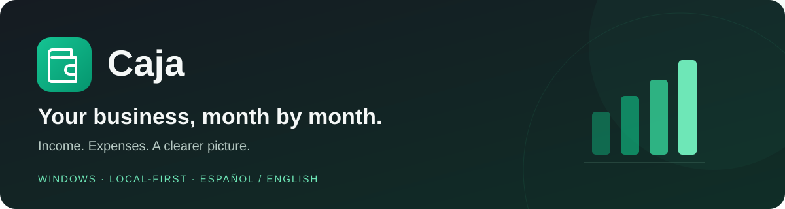
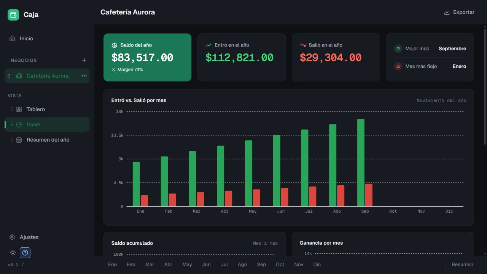
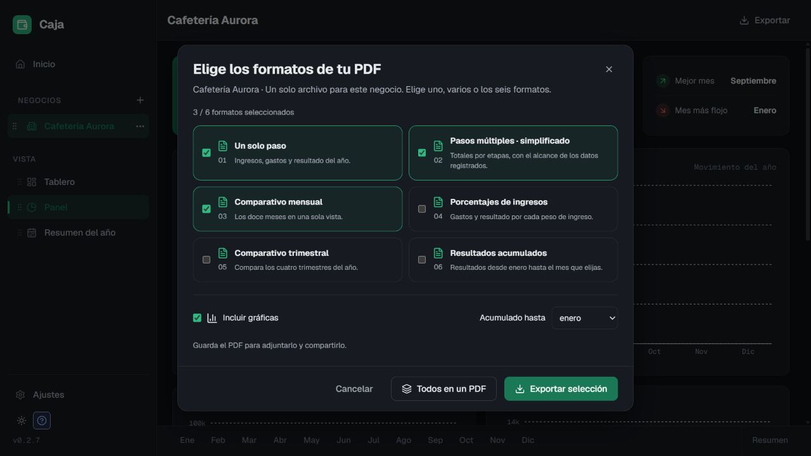

<div align="center">
  
  <p><strong>A simple desktop workspace for your small business finances.</strong></p>
  <p>Track what comes in, what goes out, and what's left. Keep your records on your own computer.</p>
  <p>
    <a href="https://github.com/dorabaee/caja-app/releases/latest"></a>
    
    <a href="LICENSE"></a>
  </p>
  <p><a href="https://github.com/dorabaee/caja-app/releases/latest"><strong>Download for Windows →</strong></a> · <a href="#get-started">Get started</a> · <a href="#for-developers">For developers</a> · <a href="https://github.com/dorabaee/caja-app/issues">Report a problem</a></p>
</div>

> **Windows only for now.** The published installer supports Windows x64. **macOS is planned for the future**; there is no supported Mac installer yet.

## A clearer view of your business

Caja brings your monthly records, bank ledger, charts, and reports into one workspace. It opens without an account and works offline. Spanish is the default language; switch to English in Settings.



*Screenshots use fictional example data. They do not contain customer or personal financial records.*

| | What you can do |
| --- | --- |
| 🗓️ **Monthly workspace** | Arrange income, expense, bank-ledger, and custom tables on a movable canvas or use the list view. |
| 📊 **Useful totals** | See money in, money out, and the remaining amount, with monthly trends and a yearly overview. |
| 🏪 **Multiple businesses** | Keep businesses separate and switch between them from the sidebar. |
| ⚡ **Faster entry** | Use quick add, recurring entries, categories, notes, and keyboard shortcuts. Undo and redo changes. |
| ❔ **Help where you need it** | Open the animated guide from the `?` button on each table. |
| 📄 **Reports to share** | Choose PDF formats and charts, or export all six views into one PDF. CSV and Excel exports are also available. |
| 💾 **Your own records** | Save backup files and restore them when moving to another computer. |
| ✨ **Make it yours** | Choose light or dark mode, six accent colors, and Spanish or English. |

## Get started

1. Open the [latest release](https://github.com/dorabaee/caja-app/releases/latest).
2. Download **`Caja_0.2.7_x64-setup.exe`** from **Assets**. The source-code ZIP is for developers.
3. Run the installer and open **Caja**.
4. Create a business, explore the example tables, and start recording your income and expenses.
5. Save a backup regularly from Settings.

**En español:** descarga el archivo **`.exe`** de la última versión, instálalo y abre Caja. Crea tu negocio y registra lo que entra y sale cada mes. **Solo Windows por ahora; macOS llegará en el futuro.**

### Updating Caja

When the installed app opens online, it checks GitHub for a newer version. An update button appears in the sidebar when one is available. Click it to download the update, save your changes, and restart Caja. You can also check manually in **Settings / Ajustes**.

The app verifies signed updater artifacts. This is separate from a Windows publisher certificate: the installer is not currently Authenticode-signed. Release assets include SHA-256 checksums for verification.

## Six ways to export your results

Open **Exportar → Estado de resultados (PDF)**. Select one or more views, toggle charts, and choose the cutoff month for cumulative results. **Todos en un PDF** puts all six into one file for the current business.



| View | Best for |
| --- | --- |
| Single-step | A concise annual overview of recorded income, expenses, and result. |
| Simplified multi-step | Reviewing the same figures in stages. |
| Monthly comparison | Comparing all twelve months side by side. |
| Common-size | Seeing expenses and results as percentages of recorded income. |
| Quarterly comparison | Comparing the four calendar quarters. |
| Year-to-date | Following cumulative results from January through your selected month. |

These are management reports based on records entered in Caja. They do not infer missing tax, cost-of-sales, or accounting adjustments. See the [report design and sources](docs/statement-formats.md) for the calculation scope.

## Privacy and backups

Business records are stored locally: a JSON document in the Windows app, or IndexedDB in the development web preview. Caja does not require an account or upload your business records to a hosted service.

The desktop updater connects to GitHub to check for and download releases. Explicit sharing actions can open an external service with the summary you choose to share. Exported PDFs and backup files stay under your control.

Keep backups somewhere safe. A local-first app cannot recover records from a lost computer without a backup. Avoid including real financial data in public GitHub issues.

## For developers

Built with **Tauri 2**, **React 19**, **TypeScript**, and **Vite**, with Zustand, Recharts, and React PDF.

Use Node.js 22 and npm. Native Windows builds also require Rust, the Microsoft C++ build tools, and WebView2. The browser preview does not install desktop updates.

```sh
npm ci
npm run dev          # http://localhost:1420
npm test
npm run build        # TypeScript + production web bundle
npm run tauri dev    # Native Windows development
```

| Directory | Responsibility |
| --- | --- |
| `src/core/` | Data model, calculations, state, translations, and export data. |
| `src/platform/` | Local storage, native dialogs, sharing, and the desktop updater. |
| `src/ui/` | Tables, dashboard, help, settings, and PDF rendering. |
| `src-tauri/` | Rust desktop shell, capabilities, and installer configuration. |

See [CONTRIBUTING.md](CONTRIBUTING.md) for contribution guidance and [release instructions](docs/releases.md) for signed builds. The current test suite covers financial calculations, updater behavior, and PDF pagination.

## Support and license

Found a problem? [Open an issue](https://github.com/dorabaee/caja-app/issues) with your Caja version, Windows version, and reproduction steps. Use fictional data in examples. For security issues, read [SECURITY.md](SECURITY.md).

Caja is available under the [MIT License](LICENSE).
